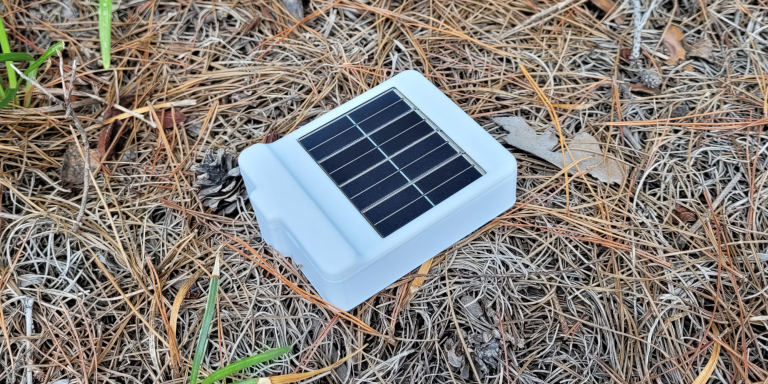
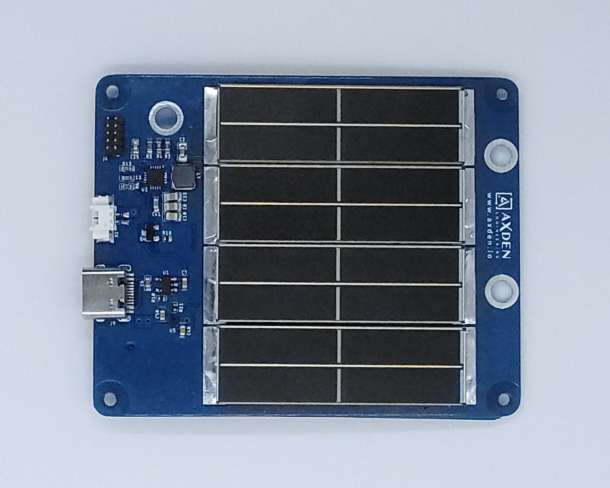
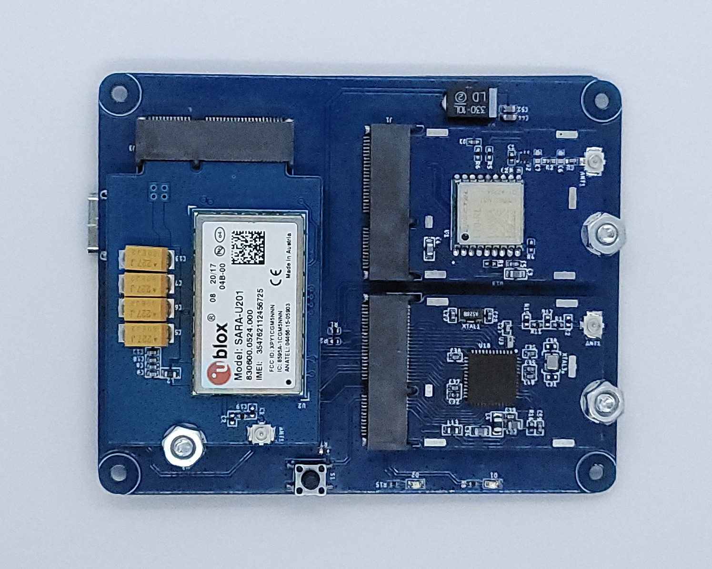
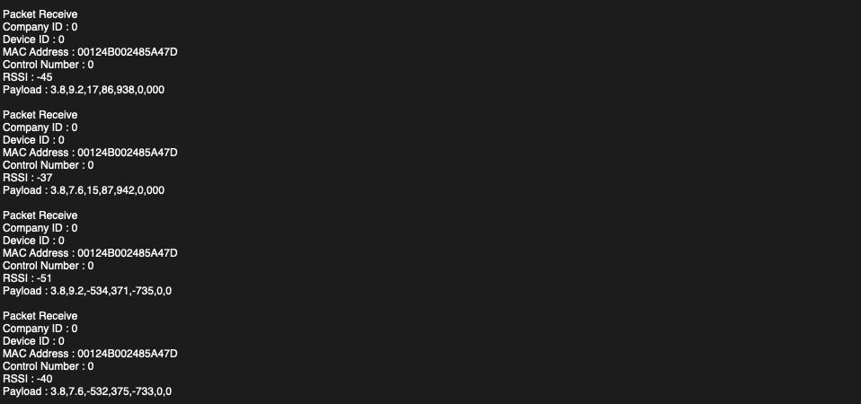
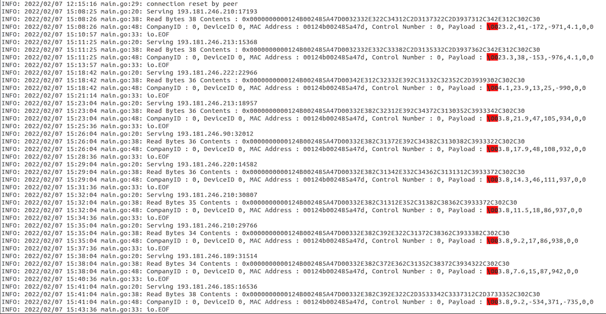
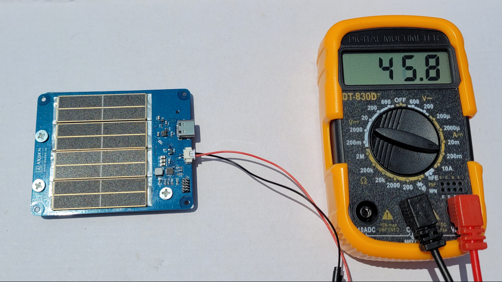
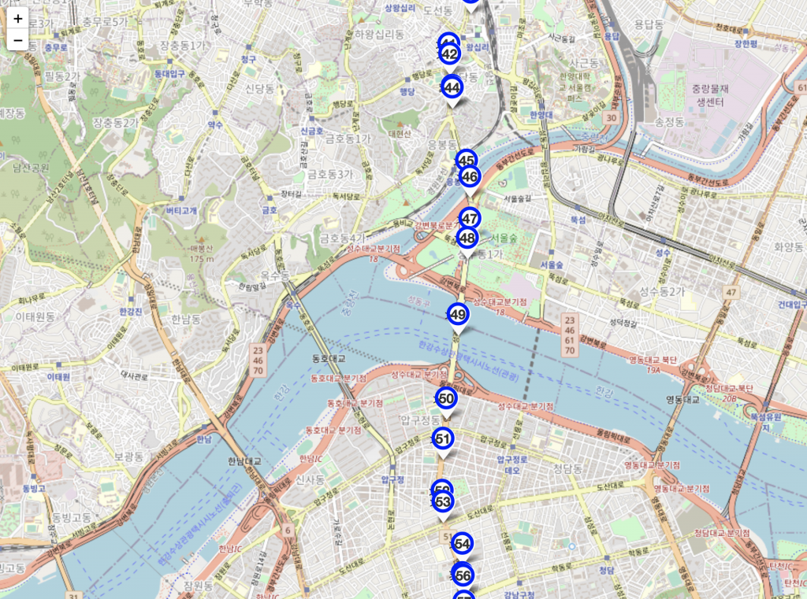
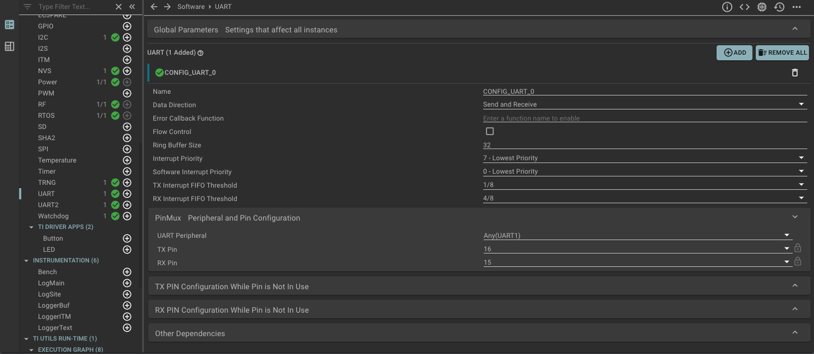
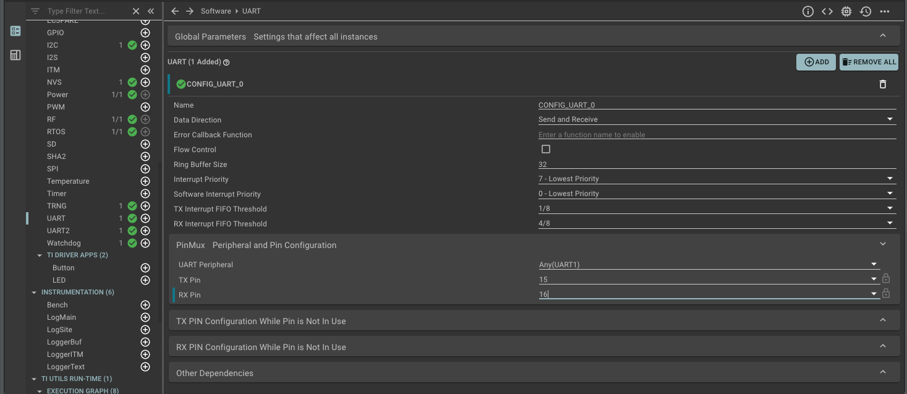

# Sub-G Solar Power Asset Tracker
<div align="center">

</div>
<br>
<table>
<tr>
<tr align="center">
  <td>TOP</td>
  <td>BOTTOM</td>
</tr>
  <tr align="center">
    <td></td>
    <td></td>
  </tr>
</table>

-------------------------

Sub-G Solar Power Asset Tracker uses AxDen's Aggregator Platform to collect key information required for asset tracking such as temperature, acceleration, and GPS location.
<br>
This is an example that provides a quick test for various service scenarios that require long-distance communication of 1Km or more or 2G/3G/4G communication.
<br>
<br>
Related hardware kits can be purchased from the Naver Smart Store.
<br>
[Purchase Link : naver smart store](https://smartstore.naver.com/axden)
<br>
<br>
You can purchase it by contacting sales@axden.io or [www.axden.io](http://www.axden.io/)
<br>

-------------------------

### Key features and functions.

MCU | Description
:-------------------------:|:-------------------------:
CC1312R1 | TI ROTS, EasyLink

*\* Low-power technology with TI Sensor Controller is available in the Production version family.*

Sensors | Description
:-------------------------:|:-------------------------:
BMA400 | 3-Axis acceleration sensor
SI7051 | temperature sensor
L70 | GPS sensor
NEO-M8N | GPS sensor
BG95/96 | 4G (LTE-M, Cat-M1)
SARA-U2 | 2G, 3G
SPV1050 | Solar battery charger (Max charge current 80mA)
Solar | On board
Battery | 3.7V Lithium Battery

The Sub-G Solar Power Asset Tracker example collects key information necessary for asset tracking, such as temperature, acceleration, and GPS location, and charges the battery using solar charging.
<br>
Transmit the collected information to Sub-G or 2G/3G/4G communication.
<br>
<br>
Interwork with AXDEN Aggregator Platform to check sensor information on the web and mobile whitout building infrastructure such as server and DB
<br>
<br>
Learn Edge AI using sensor information stored in the AXDEN Aggregator Platform.
<br>

-------------------------

### How to check using the terminal.

If you have an [AA-MB-05](http://www.axden.io/module_products/) board, you can check the communication through the terminal.
<br>

Connect the AA-MB-05 board to the PC.
<br>

-------------------------

### How to check using the server.

If you have a TCP server, you can check it through the server.
<br>
In this example, the IP and Port number of the example server provided by AXDEN are temprarily set.
<table>
  <tr align="center">
    <td>RF RX Sub-G example terminal</td>
    <td>RF RX 2G/3G/4G Server example log</td>
  </tr>
  <tr align="center">
    <td></td>
    <td></td>
  </tr>
</table>

-------------------------

### How to check the solar battery charge.

As shown in the image below, you can check the amount of battery charging current using sunlight using a multimeter.



-------------------------

### How to check using AXDEN Aggregator Platform

Register the MAC Address of the device after signing up as a member on the AXDEN Aggregator Platform website.
<br>

Enter COMPANY ID nad DEVCIE ID provided on the AXDEN Aggregator Platform website into COMPANY_ID and DEVCIE_ID in the Protocol.h header file.
<br>

[AXDEN Aggregator Platfrom](http://project.axden.io/)
<br>

`#define COMPANY_ID 0`
<br>

`#define DEVICE_TYPE 0`
<br>

Complie and flash.
<br>
<br>
Check whether COMPANY_ID and DEVICE_ID are applied correctly through the terminal
<br>
<br>
Sensor information can be found on the Web or Mobile as shown in the image below
<br>
<br>


-------------------------

### How to change the server

IP and Port can be changed in the `set_bg96_socket_connect` function of the `bg96_tcp_data_upload` function of the bg96.c file.
<br>

IP and Port can be changed in the `sara_u2_tcp_data_upload` function of the `set_sara_socket_connect` function of the sara_u2.c file
<br>

-------------------------

### How th change the GPS and cellular communication module

Module replacement is possible in the Protocol.h file.
<br>
```
#define BG96
#define SARA_U2

#define QUECTEL_GPS
#define UBLOX_GPS
````
When BG95/96 is used, -> #define SARA_U2 / Annotated
<br>
Same as the image below.Set UART Pin in syscfg file
<br>

<br>
<br>
When SARA-U2 in used, -> #define BG96 / Annotated
<br>
Same as the image below.Set UART Pin in syscfg file
<br>

<br>
<br>
When L70 in used, -> #define UBLOX_GPS / Annotated
<br>
<br>
When NEO-M8N in used -> #define QUECTEL_GPS / Annotated

### Hardware Pinmap
You can check in the board_define.h header file.

----

### [Firmware settings and compilation](https://github.com/AxDen-Dev/CC1312R1_Ping_Pong_example_gcc)

----

### [Firmware flash](https://github.com/AxDen-Dev/CC1312R1_Ping_Pong_example_gcc)
